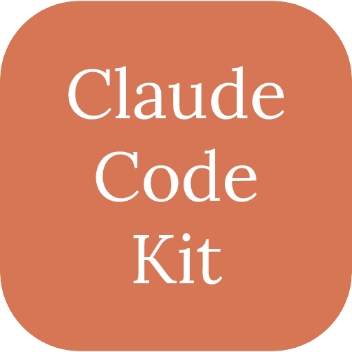

<p align="center">
  
</p>

<h1 align="center">Claude Code Kit</h1>

<p align="center">Drop-in starter templates that make Claude Code behave like a disciplined staff engineer instead of an eager intern.</p>

## The Problem

Out of the box, Claude Code is powerful but undisciplined. It will:
- Start coding before understanding the codebase
- Make sweeping changes across files you didn't ask it to touch
- Skip verification steps and ship broken code
- Forget lessons from previous mistakes
- Install dependencies and change architecture without asking

## The Solution

This kit provides a `CLAUDE.md` instruction set and supporting templates that enforce a structured workflow:

**Plan > Confirm > Implement > Verify** — every single time.

## Quick Start

```bash
npx claude-code-kit init
```

Or with curl:

```bash
curl -fsSL https://raw.githubusercontent.com/tansuasici/claude-code-kit/main/install.sh | bash
```

Then fill in `CODEBASE_MAP.md` with your project's details and start a Claude Code session.

### Installer options

| Flag | Description |
|------|-------------|
| `--template nextjs` | Use a stack-specific template (`nextjs`, `node-api`, `python-fastapi`). Auto-detected if omitted. |
| `--profile minimal` | Hooks only, no CLAUDE.md or docs |
| `--profile strict` | All hooks enabled (auto-lint, auto-format, skill-extract-reminder) |
| `--upgrade` | Add new files without overwriting your customizations |
| `--diff` | Compare local installation against latest kit (read-only) |
| `--gitignore` | Add kit files to `.gitignore` (keep kit local, don't push to repo) |
| `--version v1.0.0` | Install a specific version instead of latest |

### Uninstall

```bash
curl -fsSL https://raw.githubusercontent.com/tansuasici/claude-code-kit/main/uninstall.sh | bash
```

| Flag | Description |
|------|-------------|
| `--dry-run` | Show what would be removed without deleting |
| `--keep-tasks` | Preserve `tasks/` directory (lessons, decisions, handoffs) |
| `--keep-project` | Preserve project overlay files (`CLAUDE.project.md`, `agent_docs/project/`, etc.) |
| `--force` | Remove without confirmation |

Examples:

```bash
# Install with npx
npx claude-code-kit init --template nextjs
npx claude-code-kit init --profile strict
npx claude-code-kit init --upgrade

# Or with curl
curl -fsSL .../install.sh | bash -s -- --template nextjs
curl -fsSL .../install.sh | bash -s -- --gitignore
curl -fsSL .../install.sh | bash -s -- --upgrade
curl -fsSL .../install.sh | bash -s -- --diff
curl -fsSL .../install.sh | bash -s -- --version v1.0.0
```

### npx CLI commands

```bash
npx claude-code-kit init              # Install kit
npx claude-code-kit doctor            # Check installation health
npx claude-code-kit convert all       # Export to Cursor/Windsurf/Aider/AGENTS.md
npx claude-code-kit generate agents-md  # Generate AGENTS.md only
npx claude-code-kit --version         # Show version
```

<details>
<summary>Manual install</summary>

```bash
git clone --depth 1 https://github.com/tansuasici/claude-code-kit.git /tmp/cck
cp /tmp/cck/CLAUDE.md /tmp/cck/CODEBASE_MAP.md /tmp/cck/CLAUDE.project.md .
cp -r /tmp/cck/agent_docs /tmp/cck/tasks /tmp/cck/scripts /tmp/cck/.claude .
rm -rf /tmp/cck
```

</details>

## What CLAUDE.md Enforces

| Rule | What it does |
|------|-------------|
| **Tiered Session Boot** | Loads context in 3 tiers (always → if continuing → on demand) to minimize token overhead |
| **Plan First** | Writes a plan for multi-file changes, waits for your confirmation |
| **Scope Discipline** | Touches only what's needed, logs unrelated issues in "Not Now" |
| **Protected Changes** | Stops for approval on deps, schema, auth, API, and build changes |
| **Verification** | Typecheck, lint, test, smoke test — in that order, every time |
| **Self-Improvement** | Logs corrections to `tasks/lessons.md` and reviews them each session |

## Before / After

<details>
<summary>Without the kit</summary>

```text
You: "Add a search feature to the users page"

Claude: *immediately starts coding*
  - Installs 3 new packages without asking
  - Refactors the entire users module "while it's here"
  - Breaks the build because it didn't typecheck
  - Doesn't test anything
  - You spend 30 minutes reviewing and reverting unrelated changes
```

</details>

<details open>
<summary>With the kit</summary>

```text
You: "Add a search feature to the users page"

Claude: "Let me restate: add search functionality to the users page.
I've read CODEBASE_MAP.md — the users page is at app/(dashboard)/users/page.tsx,
data comes from src/services/user.service.ts.

This touches 3+ files, so here's my plan:"

  ## Task: Add search to users page
  ### Approach
  1. Add search param handling in users/page.tsx
  2. Add `searchUsers()` to user.service.ts
  3. Add search input component
  ### Files to Touch
  - app/(dashboard)/users/page.tsx
  - src/services/user.service.ts
  - components/features/user-search.tsx (new)

  "Should I proceed with this plan?"

You: "Yes"

Claude: *implements, then runs:*
  1. tsc --noEmit ✓
  2. eslint ✓
  3. npm test ✓
  4. Opens the page, verifies search works ✓

  "Done. All verification passed."
```

</details>

## Hooks

Hooks are shell scripts that run automatically — unlike CLAUDE.md rules (advisory), hooks are **deterministic**.

| Hook | Type | What it does |
|------|------|-------------|
| `protect-files` | PreToolUse | Blocks edits to `.env`, credentials, private keys, lock files |
| `branch-protect` | PreToolUse | Blocks push to `main`/`master` and force pushes |
| `block-dangerous-commands` | PreToolUse | Blocks `rm -rf /`, `git reset --hard`, `DROP TABLE`, etc. |
| `conventional-commit` | PreToolUse | Enforces `feat:`, `fix:`, `refactor:` commit message format |
| `secret-scan` | PostToolUse | Warns if API keys, tokens, or passwords are found |
| `unicode-scan` | PostToolUse | Detects invisible Unicode (Glassworm supply chain attack defense) |
| `loop-detect` | PostToolUse | Detects edit loops — warns at 4, blocks at 6 edits to the same file |
| `task-complete-notify` | Stop | Desktop notification + sound when Claude finishes |
| `auto-lint` | PostToolUse | Runs linter after edits *(opt-in)* |
| `auto-format` | PostToolUse | Runs formatter after edits *(opt-in)* |
| `skill-compliance` | PostToolUse | Checks edited files against active skill checklists *(opt-in)* |
| `skill-extract-reminder` | UserPromptSubmit | Reminds to extract discoveries as skills *(opt-in)* |

Opt-in hooks are not enabled by default — they can be slow or conflict with project configs. See `agent_docs/hooks.md` for how to enable them and write your own.

## Agents

Built-in agents for code review, planning, and maintenance:

| Agent | What it does |
|-------|-------------|
| `code-reviewer` | Reviews for correctness, quality, and best practices |
| `security-reviewer` | Scans code for vulnerabilities and security issues |
| `qa-reviewer` | Evidence-based QA verification |
| `planner` | Creates implementation plans with 3-lens review and failure modes |
| `dead-code-remover` | Removes verified unused code through static reference analysis |

## Skills

User-invocable audit and guide skills — run with `/skill-name`:

| Skill | What it does |
|-------|-------------|
| `/code-quality-audit` | Audits code smells, error handling, and maintainability |
| `/performance-audit` | Identifies bottlenecks in startup, rendering, memory, and I/O |
| `/architecture-review` | Reviews SOLID compliance, module boundaries, and dependencies |
| `/testing-audit` | Audits test coverage, quality, and testing strategy |
| `/dead-code-audit` | Detects unused functions, dead imports, and orphan files |
| `/refactoring-guide` | Fowler-based refactoring recommendations with execution plans |
| `/accessibility-audit` | WCAG 2.1 AA compliance audit for UI code |
| `/dependency-audit` | Checks dependencies for vulnerabilities, licenses, and bloat |
| `/documentation-audit` | Audits inline docs, API docs, and README quality |
| `/project-health-report` | Comprehensive multi-dimensional project health report |
| `/ship` | Full deployment pipeline — tests, coverage, CHANGELOG, bisectable commits, PR |
| `/retro` | Weekly retrospective with session analytics and LOC metrics |
| `/office-hours` | Pre-coding product validation — clarify what and why before coding |
| `/debug` | Systematic root-cause debugging with evidence-before-fix enforcement |
| `/design-review` | UI design consistency, AI slop detection, and responsive behavior |
| `/skill-extractor` | Extracts non-obvious knowledge into reusable skills |
| `/skill-generator` | Generates project-specific coding skills from tech stack analysis |
| `/shape-spec` | Creates timestamped feature spec folders for multi-session planning |

## Stack Templates

Each template includes a customized `CLAUDE.md` with stack-specific rules and a pre-filled `CODEBASE_MAP.md`:

| Template | Stack | Includes |
|----------|-------|----------|
| `nextjs` | Next.js 16, App Router, Prisma, Tailwind | Server/Client Component rules, build verification |
| `node-api` | Express, TypeScript, Knex.js | Layered architecture, API design conventions |
| `python-fastapi` | FastAPI, SQLAlchemy 2.0, Pydantic v2 | Async patterns, dependency injection, Alembic |

## Scripts

| Script | What it does |
|--------|-------------|
| `./scripts/doctor.sh` | Checks installation health (missing files, broken hooks, invalid settings) |
| `./scripts/validate.sh` | Checks `CODEBASE_MAP.md` for unfilled placeholders |
| `./scripts/statusline.sh` | Terminal status line showing model, branch, context %, cost |
| `./scripts/convert.sh` | Exports agents to Cursor, Windsurf, Aider, and AGENTS.md formats |
| `./scripts/gen-agents-md.sh` | Generates cross-tool AGENTS.md from project sources |
| `./scripts/validate-skills.sh` | Validates skill directory structure |
| `./scripts/gen-skill-docs.sh` | Generates web MDX docs from SKILL.md files |
| `./scripts/build-skills.sh` | Builds SKILL.md from `.tmpl` templates + shared blocks |

### Status line setup

Add to `.claude/settings.json`:

```json
{
  "statusLine": {
    "command": "./scripts/statusline.sh"
  }
}
```

```text
sonnet-4.5 | feat/search | ████████░░ 78% | $1.24
```

## Features

**AGENTS.md Export** — Generate a cross-tool [AGENTS.md](https://agents.md/) file from your project configuration. Compatible with GitHub Copilot, OpenAI Codex, Cursor, Google Jules, and Aider. Source of truth remains `CLAUDE.md` — AGENTS.md is a one-way derived output.

**Tiered Session Boot** — Context loads in 3 tiers to minimize token overhead: Tier 1 (always: project map + overlay), Tier 2 (if continuing: handoff + todo), Tier 3 (on demand: lessons top rules, decisions). Reduces startup token cost ~40-50%.

**npx Distribution** — Install and manage the kit with `npx claude-code-kit init`. Supports init, upgrade, doctor, convert, and generate commands.

**Session Handoff** — Long sessions lose context. Before ending, Claude generates `tasks/handoff-[date].md`. The next session reads it and resumes where you left off.

**Skill Extraction** — Claude discovers non-obvious things during sessions (framework quirks, workarounds, config gotchas). The skill system captures these as `.claude/skills/<name>/SKILL.md` files that load automatically via semantic matching. Run `/skill-extractor` to review.

**Architecture Decision Records** — When Claude presents options and you pick one, the reasoning gets recorded in `tasks/decisions.md` as ADRs with context, options, and consequences.

**DESIGN.md** — Optional design system template for UI projects. Captures colors, typography, spacing, component styles in a format agents read natively. The `/design-review` skill checks implementation against it.

**Product Context** — Optional templates in `agent_docs/project/` (mission.md, tech-stack.md, roadmap.md) give agents product awareness beyond code conventions.

**Permissions** — `.claude/settings.json` includes curated allow/deny lists. Allowed: test runners, linters, git reads. Denied: `curl`, `wget`, `.env` reads, `npm publish`. Review and customize for your project.

**Project Overlay** — Separate kit-managed files from project-specific customizations. `CLAUDE.project.md`, `agent_docs/project/`, and `.claude/hooks/project/` are never touched by kit upgrades, so your project rules survive `--upgrade` cleanly.

## What's Inside

<details>
<summary>Full directory structure</summary>

```text
claude-code-kit/
  CLAUDE.md                        # Core agent instructions (kit-managed)
  CLAUDE.project.md                # Project-specific overlay (yours, never overwritten)
  CODEBASE_MAP.md                  # Project mapping template
  AGENTS.md                        # Cross-tool standard (generated by gen-agents-md.sh)
  package.json                     # npm package definition (for npx distribution)
  .kit-manifest                    # Tracks kit-managed files (auto-generated)
  install.sh                       # One-line setup script
  uninstall.sh                     # Clean removal script
  bin/
    cli.sh                         # npx CLI entry point
  agent_docs/                      # Agent behavior guides
    workflow.md                    #   Planning templates & task lifecycle
    debugging.md                   #   4-step debugging protocol
    testing.md                     #   Test strategy & patterns
    conventions.md                 #   Naming, structure, git hygiene
    subagents.md                   #   When & how to use subagents
    hooks.md                       #   Hooks guide & how to write your own
    skills.md                      #   Skill extraction guide
    contracts.md                   #   Task contract system
    prompting.md                   #   Bias awareness & neutral prompting
    project/                       #   Project-specific docs (yours)
  tasks/                           # Session state & tracking
    todo.md, lessons.md, decisions.md, handoff.md
  scripts/                         # Utility scripts
    doctor.sh, validate.sh, statusline.sh, convert.sh, validate-skills.sh, build-skills.sh, gen-agents-md.sh
  .claude/
    settings.json                  # Hook configs & permissions
    agents/                        # code-reviewer, security-reviewer, planner, qa-reviewer, dead-code-remover
    hooks/                         # 12 deterministic hook scripts
      project/                     # Project-specific hooks (yours)
    skills/                        # Reusable knowledge & audit skills
      _shared/blocks/              # Shared template blocks (preamble, scope, etc.)
      _templates/                  # .tmpl skill templates (source of truth)
      skill-extractor/             # Meta-skill for knowledge extraction
      skill-generator/             # Meta-skill for generating project skills
      code-quality-audit/          # Code smells & error handling audit
      performance-audit/           # Bottleneck & rendering analysis
      architecture-review/         # SOLID & module boundary review
      testing-audit/               # Test coverage & quality audit
      dead-code-audit/             # Unused code detection
      refactoring-guide/           # Fowler-based refactoring plans
      accessibility-audit/         # WCAG 2.1 AA compliance
      dependency-audit/            # Vulnerability & license checks
      documentation-audit/         # Doc quality & sync audit
      project-health-report/       # Comprehensive health report
      ship/                        # Deployment pipeline
      retro/                       # Sprint retrospective & analytics
      office-hours/                # Pre-coding product validation
      debug/                       # Root-cause debugging
      design-review/               # UI design consistency review
      shape-spec/                  # Feature spec folder creation
  examples/
    nextjs/                        # Next.js 16 + App Router template
    node-api/                      # Express + TypeScript template
    python-fastapi/                # FastAPI + SQLAlchemy template
```

</details>

## Project Overlay

The kit separates **kit-managed files** (updated by `--upgrade`) from **project-specific files** (never touched):

| Layer | Files | Managed by |
|-------|-------|------------|
| Kit base | `CLAUDE.md`, `agent_docs/*.md`, `.claude/hooks/*.sh` | `install.sh --upgrade` |
| Project overlay | `CLAUDE.project.md`, `agent_docs/project/`, `.claude/hooks/project/` | You |

Project rules in `CLAUDE.project.md` override kit defaults. Add project-specific docs (offline-first patterns, SignalR conventions, etc.) to `agent_docs/project/` and project-specific hooks to `.claude/hooks/project/`.

The `.kit-manifest` file tracks which files are kit-managed, so upgrades know what to update and what to skip.

## Customization

This kit is a starting point. You should:

1. **Fill in `CODEBASE_MAP.md`** — the more detail, the better Claude performs
2. **Customize `CLAUDE.project.md`** — add project-specific rules, constraints, and patterns
3. **Add project docs** — put stack-specific guides in `agent_docs/project/`
4. **Track lessons** — `tasks/lessons.md` compounds over time, making Claude smarter per-project

## Contributing

PRs welcome. If you've built a template for a stack we don't cover yet, open a PR.

## License

MIT
